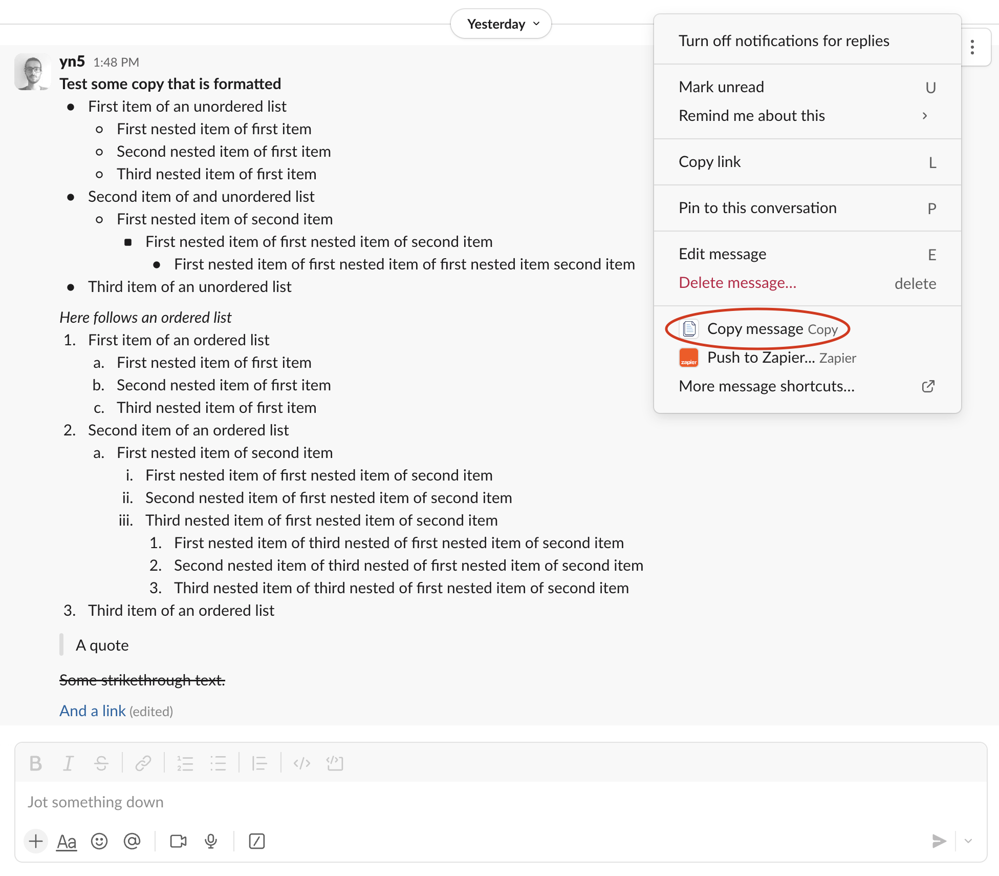

# Slack Copy App

This is a [Next.js](https://nextjs.org) project bootstrapped with [`create-next-app`](https://nextjs.org/docs/app/api-reference/cli/create-next-app).

Currently (November 2024), whenever you copy a Slack message the result is unformatted plain text. This leeds me to spending quite some time reformatting the copied text if I need it somehwere out of slack.

That's what this app is for. It adds an item to the context menu of a Slack message:


And once clicked shows a modal with the text of the message in the Markdown format used for Obsidian (currently):


## Supported content

- Currently only supports 3 layers of nested unordered lists.
- Currently only supports 3 layers of nested ordered lists with a length of 8 items per layer.

## Development getting Started

First, run the development server:

```bash
npm run dev
# or
yarn dev
# or
pnpm dev
# or
bun dev
```

Use [ngrok](https://ngrok.com/) to expose the local server to the web. You can configure that URL as the Interactivity URL in the Slack App configuration for testing the shortcut during development.
