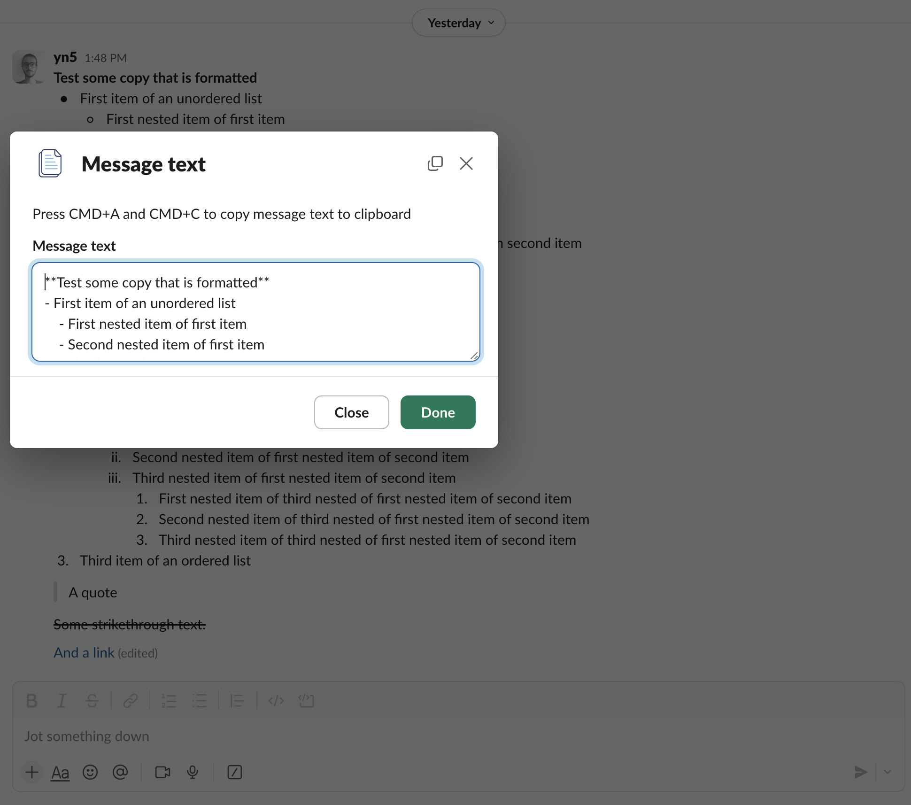

# Slack Copy App

<a href="https://slack.com/oauth/v2/authorize?client_id=1567601987477.8019638029633&scope=commands&user_scope="></a>

[](https://github.com/yn5/slack-copy-app/actions/workflows/tests.yaml) [](https://sonarcloud.io/summary/new_code?id=yn5_slack-copy-app)

This is a [Next.js](https://nextjs.org) project bootstrapped with [`create-next-app`](https://nextjs.org/docs/app/api-reference/cli/create-next-app).

Currently (November 2024), when you copy a Slack message, the text on your clipboard is unformatted (or incorrectly formatted). This leads me to spending quite some time reformatting the copied text on a weekly basis.

To address this, I created [this app](https://slack.com/marketplace/A080KJS0VJM-copy), and this repository contains the source code for its supporting web application.

The app adds an option to the context menu of a Slack message:


When clicked, it opens a modal with the message text in Markdown format, optimized for Obsidian (currently):



## Supported Content

- Currently supports up to 3 layers of nested unordered lists.
- Currently supports up to 3 layers of nested ordered lists, with a maximum of 8 items per layer.

## Development Getting Started

First, run the development server:

```bash
npm run dev
# or
yarn dev
# or
pnpm dev
# or
bun dev
```

Use [ngrok](https://ngrok.com/) to expose the local server to the web. You can configure that URL as the Interactivity URL in the Slack App configuration for testing the shortcut during development.
